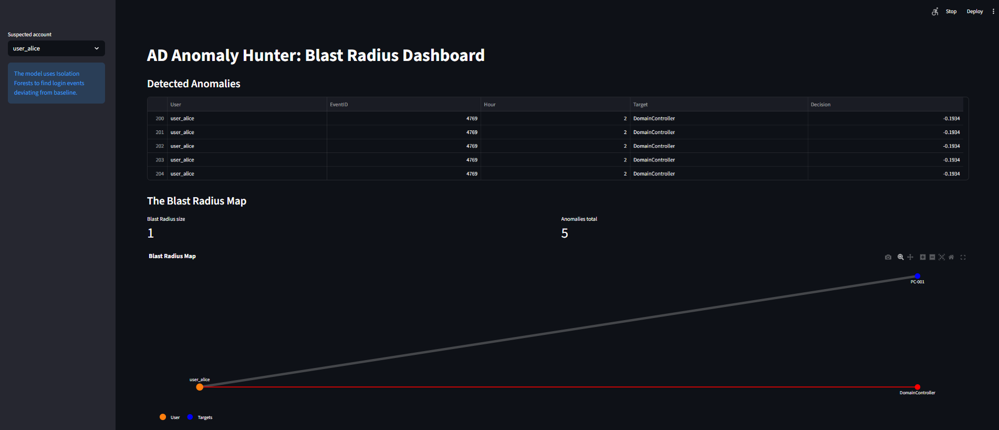

# Ghost Sentinel

This repository contains the tools and configurations for the Ghost Sentinel project, a secure environment for investigative journalism.

## Quick Start

- On your Proxmox host:
  - scp proxmox_setup.sh to the host and run: chmod +x proxmox_setup.sh && ./proxmox_setup.sh
  - When prompted, provide a local path or URL to the Whonix KVM qcow2 image
  - After creation, start the VM: qm start 100
  - Copy veracrypt_install.sh into the VM and run it

## Local Setup (VirtualBox on Windows)

- Install VirtualBox and ensure VBoxManage is in PATH.
- Open PowerShell in this folder and run:

```
Set-ExecutionPolicy Bypass -Scope Process -Force
.\local_setup.ps1 -OvaUrl "<Whonix-Workstation-OVA-URL>"
```

- Start the VM from VirtualBox or run:

```
VBoxManage startvm "Whonix-WS-Sentinel"
```

## Post-Setup Inside Whonix

- Partition and mount the second disk as a VeraCrypt volume:

```
sudo parted /dev/sdb --script mklabel gpt mkpart primary 0% 100%
sudo veracrypt --text --create /dev/sdb1
sudo mkdir -p /mnt/vault
sudo veracrypt --text --mount /dev/sdb1 /mnt/vault
```

## Self-Destruct

- Run the scrub agent inside Whonix to dismount and shred intake files:

```
python3 ~/tools/scrub_agent.py
```

## Export Evidence (Encrypted)

- Inside Whonix, to export a subset or full vault securely:

```
bash journalism_lab/vault/export_vault.sh /mnt/vault ~/exports
```

- Produces vault_export_YYYYmmdd_HHMMSS.tar.xz.gpg and a .sha256 manifest in ~/exports.

## Live Mode (RAM-Only Temps)

- For a Tails-like session that avoids disk writes for temp data:

```
bash journalism_lab/harden/session_live_mode.sh
```

- Mounts /tmp and /var/tmp as tmpfs and disables shell history for the session.

## Tor-Only CLI (Proxy All Tools via Tor)

- Apply per-session proxy environment variables:

```
bash journalism_lab/harden/tor_env.sh
```

- Sets http_proxy, https_proxy and all_proxy to socks5h://127.0.0.1:9050.

## Hardened Shell (No History)

- Disable bash history for the current session:

```
bash journalism_lab/harden/hardened_shell.sh
```

## Reset Machine Identity (Optional)

- Regenerate the system machine-id to avoid persistent host identifiers:

```
bash journalism_lab/harden/reset_machine_id.sh
```

## Delete VM Instances (Teardown)

- Proxmox host:

```
chmod +x proxmox_destroy.sh
./proxmox_destroy.sh 100
```

- Windows + VirtualBox:

```
Set-ExecutionPolicy Bypass -Scope Process -Force
.\local_destroy.ps1 -VMName "Whonix-WS-Sentinel"
```

## Wazuh Configuration: Privacy-First Monitoring

The Wazuh agent is a critical component of the Ghost Sentinel security posture. It is designed to be a "Guard," not a "Snitch."

By default, the Wazuh Agent is configured to **ignore** your `/mnt/vault` path (the VeraCrypt volume) and the `/home/user/intake` path. It only watches system files (like `/etc`, `/bin`, and `/sbin`) to ensure no rootkits or malicious software have been installed on your workstation.

Your investigative data remains invisible to the monitoring system. This ensures that your work is confidential while the system remains secure.

## Using the Ghost Workstation + Dashboard

This section explains how to operate the Whonix workstation, the Ghost dashboard at `http://localhost:8501`, and the ghost status agent so that you can tell whether you are still a "ghost" (invisible) or at risk of being tracked.

### 1. Start the Whonix environment

1. In VirtualBox, start **Whonix-Gateway-LXQt** first and wait until it boots fully.
2. Then start **Whonix-WS-Sentinel** (the workstation).
3. Inside the workstation, make sure your VeraCrypt vault is mounted at the path you use for `VERACRYPT_MOUNT` (default `/mnt/ghost_vault`).

Example: the Whonix workstation desktop and gateway running side by side:



### 2. Run the Ghost dashboard (localhost:8501)

You can run the dashboard either in Docker or directly with Python.

**Option A: Docker**

From the project folder:

```bash
docker compose up -d --build
```

Then open `http://localhost:8501` in your browser. The UI container is defined in `docker-compose.yml` and exposes port 8501.

**Option B: Local Python**

From the project folder (with Python 3.12 available):

```bash
pip install streamlit pandas scikit-learn plotly networkx requests feedparser
streamlit run app.py --server.port 8501 --server.headless true --browser.gatherUsageStats false
```

Then open `http://localhost:8501` in your browser.

### 3. Ghost Status: Invisible vs At Risk

At the top of the dashboard you will see **Ghost Status**. It summarizes whether you are operating as a ghost (anonymous and compartmentalized) or are at risk.

The status is derived from:

- Tor SOCKS port reachability (127.0.0.1:9050 or `host.docker.internal:9050`)
- Ability to reach Tor-only destinations through the Tor proxy
- Inability to reach the same destinations directly (clearnet)
- Presence of the VeraCrypt vault mount (`VERACRYPT_MOUNT`, default `/mnt/ghost_vault`)
- A `tracked` flag written to `c:\ProgramData\Wazuh\logs\ghost_status.json`

Interpretation:

- **Invisible** – Tor proxy and Tor HTTP work, direct HTTP is blocked, and the vault is present, with no tracked flag.
- **At Risk** – Tor is down, direct HTTP is reachable, the vault is missing, or the tracked flag is set.
- **Unknown** – Not enough information yet (for example, during bootstrap).

Use the **Re-check Ghost Status** button on the dashboard to force a fresh check of all signals.

### 4. Ghost status agent (host-side)

To keep the Ghost Status updated automatically, run the ghost status agent on the host:

```bash
python -m supply_chain.agentic.ghost_status_agent --loop
```

The agent will periodically write `c:\ProgramData\Wazuh\logs\ghost_status.json` with a structure like:

```json
{
  "tracked": false,
  "ts": 1730850000,
  "signals": {
    "tor_port": true,
    "tor_http": true,
    "direct_http": false,
    "vault_present": true,
    "veracrypt_mount": "C:\\\\GhostVault"
  }
}
```

The dashboard reads this file and visualizes whether you are still a ghost.

You can also force an immediate **At Risk** signal by writing:

```json
{"tracked": true}
```

to `c:\ProgramData\Wazuh\logs\ghost_status.json`. This is useful as a manual panic indicator or when other tooling detects deanonymization risk.

### 5. Newsfeeds and CTI briefing

The dashboard contains two news-related sections:

- **Morning Report** – pulls a CTI RSS feed (default SANS ISC) and uses the local AI to summarize the top items into a short briefing.
- **News Feeds** – lets you select from curated feeds (SANS, Krebs, Whonix blog, The Intercept) and fetch headlines, optionally summarizing the top items.

The fetch logic prefers Tor:

- If `TOR_SOCKS` is set (for example `socks5h://127.0.0.1:9050`), HTTP requests for newsfeeds go through that proxy.
- If Tor is not reachable, the dashboard falls back to direct fetches, which will normally be blocked in a hardened Whonix setup.

This keeps the OSINT/news layer aligned with the ghost principle: the workstation scouts for data over Tor, summarizes locally, and never uploads your notes or vault contents.

## Environment Variables

- VERACRYPT_MOUNT: default `/mnt/ghost_vault`
- STAGING_DIR: default `/mnt/ghost_vault/intake/staging`
- TOR_SOCKS: default `socks5h://127.0.0.1:9050`
- ONIONSHARE_DIR: default `~/OnionShare`
- OLLAMA_HOST: default `http://localhost:11434` (or `http://ollama:11434` in Docker)
- WAZUH_HOST, WAZUH_USER, WAZUH_PASS: optional if you enable Wazuh context in the dashboard

## Troubleshooting

### Black screen on Workstation
- Close the VM, then in VirtualBox Settings → Display:
  - Graphics Controller: VMSVGA
  - Video Memory: 128 MB
  - 3D Acceleration: OFF
- System → Enable EFI.
- Start Gateway first, then start Workstation.

### Tor connection error in Workstation
- Ensure Gateway is running and fully bootstrapped.
- Gateway terminal:
  - `sudo systemctl restart tor`
  - `sudo systemctl status tor`
  - `whonixcheck`
- Workstation terminal:
  - `whonixcheck`
- Retry after 1–2 minutes and re-check the dashboard.

### Dashboard not reachable
- If port 8501 is busy, stop the old process and rerun:
  - `streamlit run app.py --server.port 8501 --server.headless true`
- Docker users: `docker compose up -d --build`

### Autostart ghost status agent (Windows)
- Create a Task Scheduler entry that runs at logon:
  - Action: `python -m supply_chain.agentic.ghost_status_agent --loop`

## Full Test Plan

### Local (Windows + VirtualBox)

1. Create VM with second disk:
   ```
   Set-ExecutionPolicy Bypass -Scope Process -Force
   .\local_setup.ps1 -OvaUrl "<Whonix-Workstation-OVA-URL>"
   VBoxManage startvm "Whonix-WS-Sentinel"
   ```
   - Verify VM exists in VirtualBox and a second disk (veracrypt.vdi) is attached.

2. Inside Whonix: set up vault (see Post-Setup Inside Whonix).
   - Verify /mnt/vault is mounted and persists across remounts.

3. Enable Tails-like behavior:
   ```
   bash journalism_lab/harden/session_live_mode.sh
   bash journalism_lab/harden/hardened_shell.sh
   ```
   - Verify tmpfs on /tmp and /var/tmp; history disabled.

4. Route CLI via Tor:
   ```
   bash journalism_lab/harden/tor_env.sh
   ```
   - Verify proxy env vars are set.

5. Self-destruct staging and dismount:
   ```
   mkdir -p /home/user/intake
   echo "leak" > /home/user/intake/leak.txt
   python3 ~/tools/scrub_agent.py
   ```
   - Verify intake is empty and vault is dismounted.

6. Export encrypted evidence:
   ```
   bash journalism_lab/vault/export_vault.sh /mnt/vault ~/exports
   ```
   - Verify .gpg and .sha256 files in ~/exports and checksum OK.

7. Minimize logs and identifiers (optional):
   ```
   bash journalism_lab/harden/wipe_logs.sh
   bash journalism_lab/harden/reset_machine_id.sh
   ```

8. Teardown VM (local):
   ```
   Set-ExecutionPolicy Bypass -Scope Process - Force
   .\local_destroy.ps1 -VMName "Whonix-WS-Sentinel"
   ```

### Proxmox Path

1. Provision VM with second disk:
   ```
   scp proxmox_setup.sh root@<proxmox-host>:/root/
   ssh root@<proxmox-host>
   chmod +x proxmox_setup.sh
   ./proxmox_setup.sh
   ```
   - Provide Whonix KVM qcow2 URL or path when prompted.
   - Verify with `qm config 100` that scsi0 and scsi1 are present; start with `qm start 100`.

2. Inside Whonix: repeat the same tests as local (vault, live mode, tor_env, self-destruct, export, wipe logs).

3. Teardown VM (Proxmox):
   ```
   chmod +x proxmox_destroy.sh
   ./proxmox_destroy.sh 100
   ```
